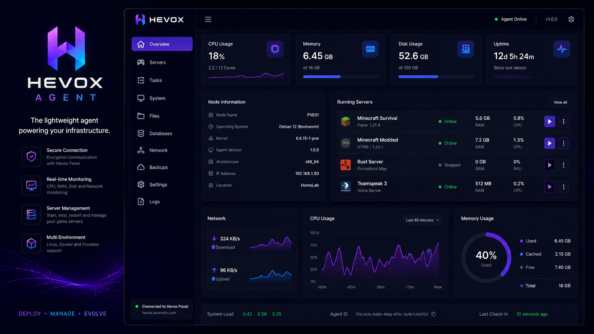

<p align="center">
  
</p>

<p align="center">
  <strong>The lightweight node agent powering the Hevox ecosystem.</strong>
</p>

<p align="center">
  <a href="https://github.com/bretazaaa/hevoxagent-releases/releases/latest">
    
  </a>
  
  
  
</p>

---

## About

**Hevox Agent** is the node-side service used by Hevox to manage and monitor game server infrastructure.

It provides secure communication between the **Hevox Panel** and your nodes, handling server operations, monitoring and infrastructure tasks.

> This repository contains **compiled releases only**.
> The Hevox Agent source code is maintained in a private repository.

<p align="center">
  
</p>

## Installation

Install the latest version with:

```bash
curl -sSL https://raw.githubusercontent.com/bretazaaa/hevoxagent-releases/main/install.sh | sudo bash
```

The installer automatically downloads and installs the latest available release.

## Update

Run the installation command again to update Hevox Agent to the latest version.

## Releases

Pre-built Debian packages are available from the [Releases](https://github.com/bretazaaa/hevoxagent-releases/releases) page.

## Requirements

* Linux
* Debian / Ubuntu based distribution
* Root or sudo access
* Network access to your Hevox Panel

---

<p align="center">
  
</p>

<p align="center">
  <strong>Hevox</strong><br>
  Deploy. Manage. Evolve.
</p>
